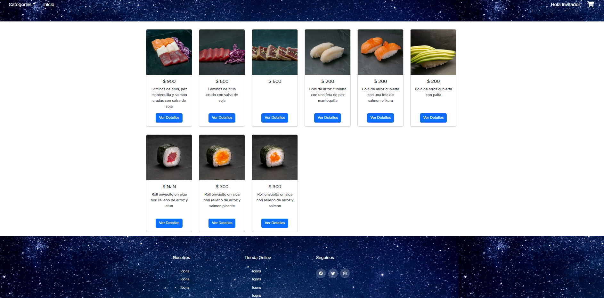
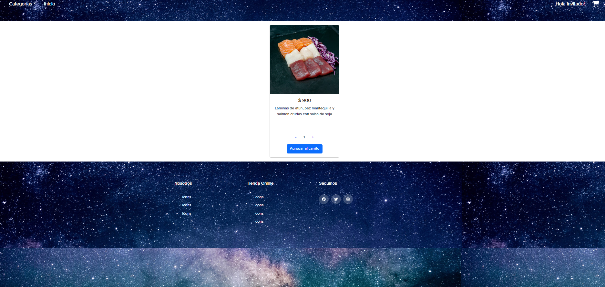
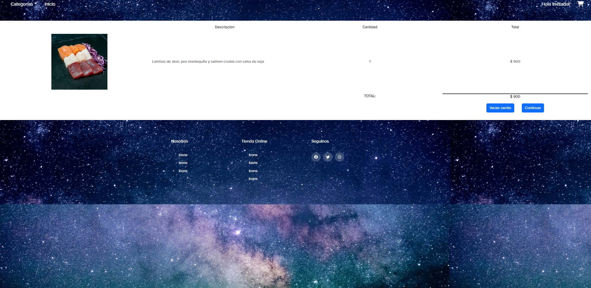
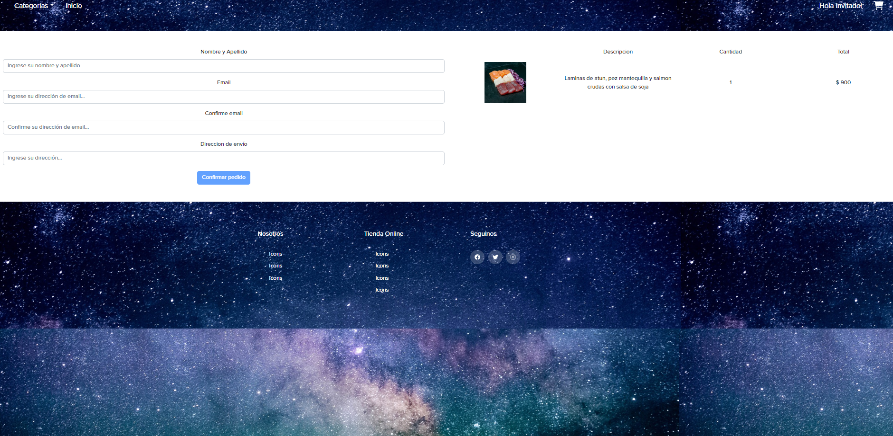
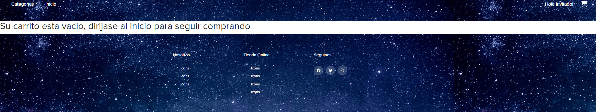
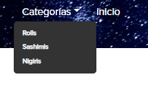
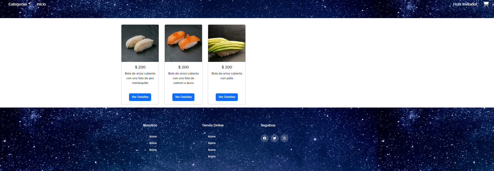
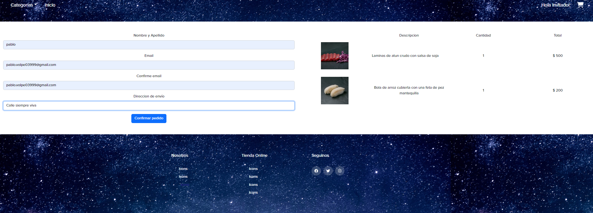
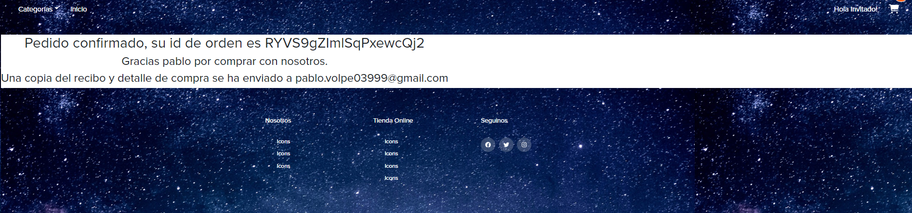

# Todo Sushi
*Todo Sushi es un proyecto ecommerce realizado totalmente funcional para el curso de coderhouse de REACTJS, Se utilizaron varias tecnologias, react-bootstrap para partes de la maquetacion y diseño, Firebase/firestore para ordenes de productos desde su base de datos, react-toastify para las notificaciones que se muestran en la aplicacion para funciones de boton agregar al carrito, asi como tambien react-router-dom para las rutas de navegacion* 

# Instalación
1. Abrimos la consola de comando del gusto del que la utilize

2. Clonamos el directorio
`git clone https://github.com/PabloAlejandroVolpe/ProyectoFinal`

3. Instalamos las dependencias completas
 `npm install`

4. Arrancamos la aplicación localmente
`npm start`
    
# Uso
*A continuacion, se muestra el funcionamiento del sitio*

